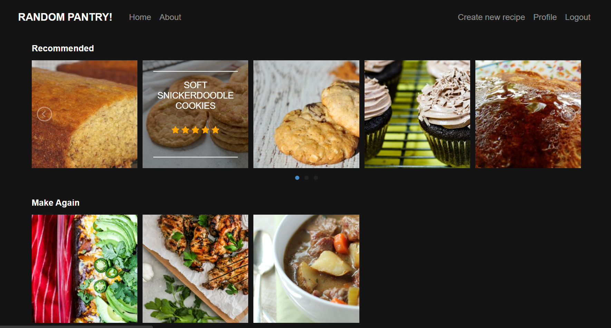

# RANDOM PANTRY!

## Overview
Random Pantry is a recipe recommender system that uses Machine Learning to give you recipes that you will enjoy! We're still working on it, but feel free to have a look around at what we have so far :D

## Technologies
* [Python 3](https://www.python.org) - Main programming language
* [Django](https://www.djangoproject.com/) - Python-based web framework
* [jQuery](https://jquery.com/) - HTML DOM tree traversal and manipulation
* [Bootstrap](https://getbootstrap.com/) - Main front-end component library
* [Heroku](https://www.heroku.com/) - Cloud Application Platform
* [PostgreSQL](https://devcenter.heroku.com/categories/heroku-postgres) - Relational database management system
* [Redis](https://devcenter.heroku.com/articles/heroku-redis) - In-memory data structure store for caching
* [Selenium WebDriver](https://selenium.dev/documentation/en/webdriver/) - Web automation framework for data scraping
* [scikit-learn](https://scikit-learn.org) - SVD, TSVD and KNN algorithms (Content-based filtering) 
* [scikit-suprise](http://surpriselib.com/) - Matrix Factorization (SVD) algorithm (Collaborative filtering)

## References
* [Kaggle Data Source](https://www.kaggle.com/shuyangli94/food-com-recipes-and-user-interactions)
* [Image Data Source](https://www.food.com/)
* [Image Hover Effects](https://miketricking.github.io/bootstrap-image-hover/)
* [lightSlider](http://sachinchoolur.github.io/lightslider/index.html)
