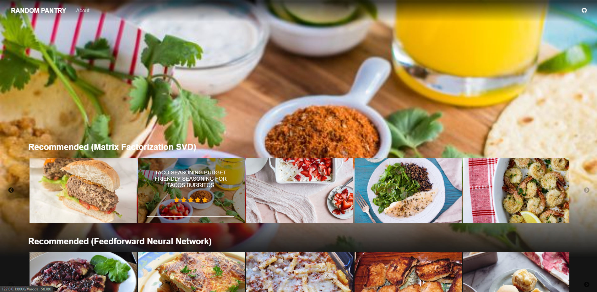

# Random Pantry

Random Pantry is a recipe recommender system that uses machine learning algorithms. It is designed to give you recipes that you will enjoy!

## Usage

### Access
- Website URL: https://randompantry.herokuapp.com

### Rating a Recipe
- TODO:

### Getting Recommendations
- TODO:

### Getting Similar Recipes
- TODO:

### Tuning SVD++ Model
- n_factors - The number of latent factors
- n_epochs - The number of steps or iterations for Stochastic Gradient Descent algorithm
- lr_all - The learning rate or step size for for all parameters
- reg_all - The regularization term for all parameters
- These parameters will takes precedence over lr_all:
    - lr_bu - The learning rate for bu
    - lr_bi - The learning rate for bi
    - lr_pu - The learning rate for pu
    - lr_qi - The learning rate for qi
    - lr_yj - The learning rate for yj
- These parameters will takes precedence over reg_all:
    - reg_bu - The regularization term for bu
    - reg_bi - The regularization term for bi
    - reg_pu - The regularization term for pu
    - reg_qi - The regularization term for qi
    - reg_yj - The regularization term for yj

## Technologies
### Languages
* [Python](https://www.python.org) - Backend Language
* [TypeScript](https://www.typescriptlang.org/) - Front-end Language

### Frameworks
* [django](https://www.djangoproject.com/) - Backend Framework
* [Angular](https://angular.io/) - Front-end Framework

### Machine Learning Libraries
* [NumPy](https://numpy.org/)
* [pandas](https://pandas.pydata.org/)
* [scikit-learn](https://scikit-learn.org) - Truncated SVD and K-Nearest Neighbours algorithms
* [SurPRISE](http://surpriselib.com/) - SVD++ algorithm

### Database & Others
* [PostgreSQL](https://www.postgresql.org/) - Relational Database
* [Redis](https://redis.io/) - In-memory Data Structure Store
* [Celery](http://www.celeryproject.org) - Distributed Task Queue
* [Honcho](https://honcho.readthedocs.io/en/latest/) - Procfile-based Application Manager
* [Food.com Recipes and Interactions](https://www.kaggle.com/shuyangli94/food-com-recipes-and-user-interactions) - Dataset Source
* [Food.](https://www.food.com/) - Images Source

## Contributors
|  |  |  |
| :-: | :-: | :-: |
| [`irkules`](http://github.com/irkules) | [`irkaal`](http://github.com/irkaal) | [`deonnem`](http://github.com/deonnem) |

## Changes
- Version 1.0
    - Initial implementation of Random Pantry
- Version 2.0
    - Addition of Angular
    - Replacement of lightSlider with slick
    - Addition of Global User
    - Removal of User and Recipe creation feature
    - Modification of Reviews Table to save ratings only
    - Addition of Database Caching
    - Implementation of async tasks using Celery
    - Addition of SVD++ Tuning interface

## Reference Papers
- Francesco Ricci, Lior Rokach, Bracha Shapira, and Paul B. Kantor. Recommender Systems Handbook. 1st edition, 2010.
- Ruslan Salakhutdinov and Andriy Mnih. Probabilistic matrix factorization. 2008. URL: http://papers.nips.cc/paper/3208-probabilistic-matrix-factorization.pdf.
- Yehuda Koren. Factorization meets the neighborhood: a multifaceted collaborative filtering model. 2008. URL: http://www.cs.rochester.edu/twiki/pub/Main/HarpSeminar/Factorization_Meets_the_Neighborhood-_a_Multifaceted_Collaborative_Filtering_Model.pdf.
- Yehuda Koren, Robert Bell, and Chris Volinsky. Matrix factorization techniques for recommender systems. 2009.
